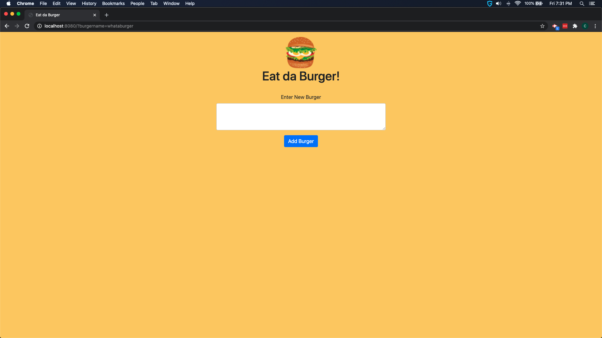

# Eat da Burger

## Table of Contents

[Description](#description)

[Technologies Used](#technologies)

[Application Usage](#application-usage)

[Screenshots](#application-screenshot)

[Deployed Application](#deployed-application)

[Installation](#installation)

[Credits](#credits)

[License](#license)

## Description

Simple Web Application that allows you enter burgers names then devour them with a button click

## Technologies

javascript, jquery, ajax, nodejs, npm, mysql, express, express-handlebars, html, css

## Application Usage

Goto app URL > type a burger name > click "Add Burger" button. All un-devoured burger entries will be listed on the left while burgers you have "devoured" by clicking devour button will be listed on the right. On first launch if there are no burgers in the database then only the "enter new burger" text area will be displayed

## Application Screenshot

## Deployed Application

## Installation

1. copy repository to local drive
2. open connection.js file and change password to root password on local mysql instance
3. run npm install for all npm dependencies
4. navigate to db director in a terminal
5. Start MySQL command line tool and login: mysql -u root -p.
6. With the mysql> command line tool running, enter the command source schema.sql.
7. with mysql> command line tool running enter the command source seeds.sql to install seed records
8. exit mysql> command line by typing exit
9. cd to parent burger directory and run npm start
10. \*\*if some dependencies are still missing then install them individually

## Credits

App would not be possible if not for the developers responsible for the technologies listed above

## License

Licensed under the [MIT](LICENSE) license
